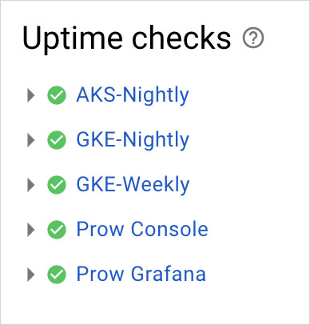
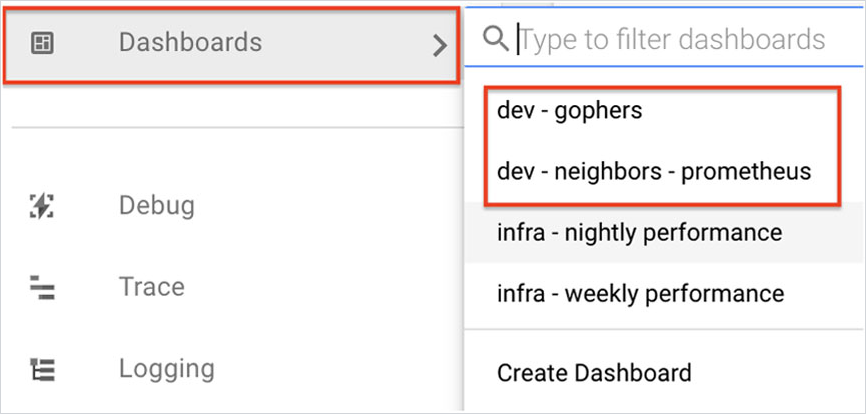

# Prow Cluster Monitoring Setup

This document describes how to install and manage Prow cluster monitoring that is available at `https://monitoring.build.kyma-project.io`. 
This document also describes how to create and manage Grafana dashboards.

## Prerequisites

Install the following tools:

- Helm v2.11.0
- kubectl

## Configure Slack for failure notifications

Follow these steps:

1. Create a Slack channel and an [Incoming Webhook](https://api.slack.com/incoming-webhooks) for this channel. Copy the resulting Webhook URL.

2. Replace `{SLACK_URL}` with channel Weebhook URL and `{SLACK_CHANNEL}` with the channel name in [alertmanager-config.yaml](../../prow/cluster/resources/monitoring/alertmanager-config.yaml).

## Provision a monitoring chart

Follow these steps:

1. Make sure that kubectl points to the correct cluster.
   
   ```bash
   gcloud container clusters get-credentials {clusterName} --zone={zoneName} --project={projectName}
   ```

2. Go to the [`prow/cluster`](../../prow/cluster) directory.

3. Download dependencies:
   
   ```bash
   helm dependency build resources/monitoring
   ```

4. Install the monitoring chart:

   ```bash
   helm install --name {releaseName} --namespace {namespaceName} resources/monitoring -f values.yaml,prometheus-config.yaml,alertmanager-config.yaml,grafana-config.yaml
   ```

5. Open the Grafana dashboard.
   
   Grafana dashboard is available at `https://monitoring.build.kyma-project.io`. It can take some time till the dashboard is accessible.

## Authenticate to Grafana

By default, Grafana dashboards are visible for anonymous users with the read-only access. Only authenticated users are able to create and edit dashboards. To sign in to Grafana, follow this steps:

1. Get the password for the `admin` user from the cluster:

   ```bash
   kubectl -n {namespaceName} get secret {releaseName}-grafana -o jsonpath="{.data.admin-password}" | base64 -D
   ```

2. Go to `https://monitoring.build.kyma-project.io/login`.

3. Provide credentials:

   ```
   Login: admin
   Password: {The value from step 1}
   ```

## Create and edit Grafana dashboards

To create or edit Grafana dashboards you must be signed in. The [official Grafana documentation](http://docs.grafana.org/guides/getting_started/) provides instructions on how to work with the dashboards. The main difference between the official guidelines and the the Kyma implementation of Grafana dashboards is the way in which you store them.

Follow these steps to save the dashboard:

1. Export the dashboard to a JSON format.

2. Save the JSON file under `prow/cluster/resources/monitoring/dashboards/`.

3. Update the Grafana configuration on the cluster.
   
   ```bash
   helm upgrade {releaseName} resources/monitoring --recreate-pods
   ```

   > **NOTE:** `--recreate-pods` is required because the Secret with the Grafana password is regenerated during the upgrade and it needs to be populated to Grafana.

## Add recording and alerting rules

1. Add new recording or alerting rules to the [PrometheusRule specification](../../prow/cluster/resources/monitoring/templates/prow_prometheusrules.yaml).

2. Replace the existing PrometheusRule object with the current file version.
   ```bash
   kubctl replace -f prow/cluster/resources/monitoring/templates/prow_prometheusrules.yaml
   ```
## Stackdriver Monitoring

### Workspace sap-kyma-prow-workload

This workspace is used for:
 - short-living-gke-clusters - test jobs
 - long-running-gke-clusters (`weekly` and `nightly`)

#### Dashboards
Stackdriver Monitoring dashboards provide visibility into the performance, uptime, and overall health of long running Kyma test clusters:
 - [nightly](https://app.google.stackdriver.com/dashboards/2395169590273002360?project=sap-kyma-prow-workloads)
 - [weekly](https://app.google.stackdriver.com/dashboards/7169385145780812191?project=sap-kyma-prow-workloads)

It also provides information about overall [status](https://app.google.stackdriver.com/uptime?project=sap-kyma-prow-workloads) 
of long-running clusters and test-infra infrastructure:
 



Kyma developers have necessary permissions to create custom dashboards in [sap-kyma-prow-workload workspace](https://app.google.stackdriver.com/?project=sap-kyma-prow-workloads) however it is required to follow dashboard naming convention that looks as follows:
`dev - {team_name}`



#### Metrics explorer

[Metrics explorer](https://cloud.google.com/monitoring/charts/metrics-explorer) lets you build ad-hoc charts for any metric collected by the project.
Stackdriver provides set of built-in metric types, see the [Metrics](https://cloud.google.com/monitoring/api/metrics).

#### Log based metrics

Log-based metrics can be created based on anything that was printed to logs from any gke cluster.
This means that you can grab any logs from our long and short leaving clusters and create a metric based on that - 
it can count occurrences of a particular error or aggregate numbers extracted from a message.


#### Prometheus collector
Gathering additional metrics requires [stackdriver-prometheus collector](https://cloud.google.com/monitoring/kubernetes-engine/prometheus). 
Adding `--enable-stackdriver-kubernetes` is required for enabling Stackdriver Kubernetes Engine Monitoring support on k8s cluster. 

Collecting all the data is not possible due to high costs (hundreds of dollars per day) therefore there is a metric [filter](https://github.com/kyma-project/test-infra/blob/97f2b403f3e2ae6a4309da7e2293430f555442e8/prow/scripts/resources/prometheus-operator-stackdriver-patch.yaml#L14) applied to limit the volume of data sent to Stackdriver.

### Workspace sap-kyma-prow

Data collected in sap-kyma-prow workspace are mainly Prow performance metrics and metrics that are based on the content of log entries, 
they help us track ongoing and most common issues.

Although the workspace is not available for Kyma developers they can see following dashboards: 
 - [Prow cluster performance](https://storage.cloud.google.com/kyma-prow-logs/stats/index.html?authuser=1&orgonly=true) 
 - [Prow infrastructure log-based checks](https://storage.cloud.google.com/kyma-prow-logs/stats/checks.html?authuser=1&orgonly=true)


Creating new log-based metrics is possible and requires creating new [issue](https://github.com/kyma-project/test-infra/issues/new/choose) with Neighbors team.
Log-based metrics can be created based on anything that was printed to logs from any Prow job.
